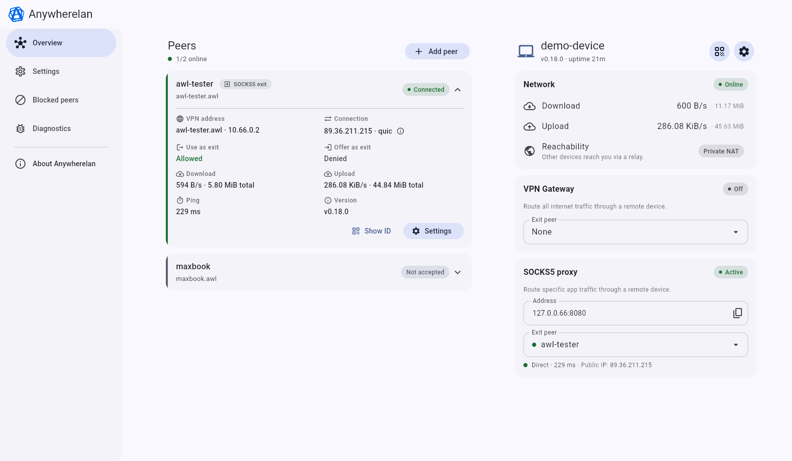
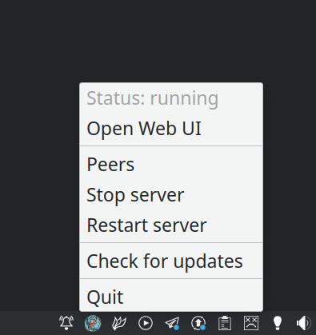

<p align="center">
    <a href="https://github.com/anywherelan/awl/blob/master/LICENSE"></a>
    <a href="https://github.com/anywherelan/awl/releases"></a>
    <a href="https://github.com/anywherelan/awl/actions/workflows/test.yml"></a>
</p>


# Table of contents

- [About](#about)
  - [Why Anywherelan](#why-anywherelan)
  - [Features](#features)
  - [Screenshots](#camera-screenshots)
  - [How it works](#how-it-works)
  - [Security](#security)
- [Installation](#installation)
  - [The web UI](#the-web-ui)
  - [Android](#android)
  - [Windows (`awl-tray`)](#windows-awl-tray)
  - [macOS](#macos)
  - [Linux desktop (`awl-tray`)](#linux-desktop-awl-tray)
  - [Linux server (`awl`)](#linux-server-awl)
- [Connecting devices](#connecting-devices)
- [Using devices as SOCKS5 proxy](#using-devices-as-socks5-proxy)
- [VPN gateway (full-tunnel exit node)](#vpn-gateway-full-tunnel-exit-node)
- [Configuration](#configuration)
  - [Config file location](#config-file-location)
  - [Example config](#example-config)
- [Monitoring](#monitoring)
- [Terminal-based client](#terminal-based-client)
  - [Common examples](#common-examples)
- [Upgrading](#upgrading)
- [Contributing](#contributing)
- [License](#license)

# About

Anywherelan (awl for brevity) is a peer-to-peer mesh VPN for connecting your own devices to each other, at the IP level, from wherever they are. A laptop behind a NAT, a home server, an old phone — give each one a stable `.awl` address and they can reach each other as if they were on the same LAN.

awl is fully decentralized: no coordination server, no account, no control plane — nothing to pay for, nothing to sign up for, nothing that can be shut down from the outside. Everything awl needs is in this repository, under an open-source license.

awl is aimed at personal use: selfhosters, groups of friends, small device fleets (roughly ~10s). It is not a replacement for commercial mesh VPNs in a team setting — there are no ACLs, tags, SSO, or admin dashboards.

Some things people use it for:

- SSH / RDP / VNC into your home or work laptop from anywhere, without port forwarding or exposing anything to the internet
- reach selfhosted services (Nextcloud, Home Assistant, Bitwarden, ...) privately
- route traffic through a remote device as a SOCKS5 proxy — useful for bypassing regional blocks
- route *all* your traffic through a remote device at the IP layer — a full-tunnel VPN gateway / exit node
- LAN-style multiplayer gaming across the internet
- keep an old Android phone accessible for apps that only run there (e.g. with [scrcpy](https://github.com/Genymobile/scrcpy))

## Why Anywherelan

Tailscale, Netbird and ZeroTier are excellent products, especially for teams. awl is a different shape:

- **Fully peer-to-peer.** There is no coordination server to trust, fund, or depend on. Peers find each other via libp2p's DHT and connect directly; encrypted traffic only flows through third parties (community relays) when both sides are behind restrictive NATs and no direct path is possible.
- **Fully open source.** Every part of the stack — clients, bootstrap nodes, relays — is open. There is no closed-source control plane quietly running the show.
- **Harder to block.** There is no single endpoint an ISP or government can blackhole. DHT discovery plus libp2p's transport negotiation makes awl more survivable on restrictive networks than VPNs that depend on a central coordination server.

Tradeoffs worth knowing about:

- No centralized policy management (no ACLs, no device tags, no SSO).
- Smaller feature set than commercial alternatives. Bigger features are in flight; for now, awl is best at the thing it already does well — getting your devices talking to each other.

## Features

- fully peer-to-peer, no coordination server — see [Why Anywherelan](#why-anywherelan) above
- route **all** your traffic through a device — full-tunnel VPN gateway / exit node
- route traffic through a device as a SOCKS5 proxy
- automatic NAT traversal via libp2p; falls back to community relays when a direct path isn't possible
- TLS 1.3 encryption (QUIC or TCP+TLS)
- built-in DNS: reach devices at `work-laptop.awl` instead of typing IPs
- Windows, Linux, macOS, Android

## :camera: Screenshots

<div align="center">
  <table cellpadding="0" cellspacing="0" style="margin: auto; border-collapse: collapse;">
    <tr style="border: none;"><td style="border: none;">
      
    </td><td style="border: none;">
      
    </td></tr>
  </table>
</div>

<div align="center">
  <table cellpadding="0" cellspacing="0" style="margin: auto; border-collapse: collapse;">
    <tr style="border: none;"><td style="border: none;">
      
    </td><td style="border: none;">
      
    </td></tr>
  </table>
</div>

## How it works

awl combines two things: a virtual network interface (TUN on Linux/macOS/Android, [wintun](https://www.wintun.net/) on Windows) and a peer-to-peer networking stack built on [libp2p](https://libp2p.io/). IP packets sent into the awl interface are wrapped into libp2p streams and delivered directly to the addressed peer.

- **Transport:** QUIC (with native TLS 1.3) or TCP+TLS, negotiated per-connection.
- **Discovery:** on startup, awl announces itself in the libp2p [DHT](https://en.wikipedia.org/wiki/Distributed_hash_table) via community [bootstrap nodes](https://github.com/anywherelan/awl-bootstrap-node). To reach a peer, awl looks it up in the DHT and opens a connection directly.
- **NAT traversal and relays:** libp2p handles hole-punching for most NATs; when both peers are behind restrictive NAT, traffic is forwarded through a libp2p circuit relay. Relays only see encrypted bytes. For details on the mechanics, see [libp2p's NAT docs](https://docs.libp2p.io/concepts/nat/overview/).

## Security

awl's transport security comes from [libp2p](https://docs.libp2p.io/).

- **Encryption:** all peer traffic is TLS 1.3, via either QUIC (which uses TLS natively) or TCP+TLS. Bootstrap nodes and relays see only ciphertext.
- **Identity:** each peer has an `ed25519` keypair; the `peer_id` *is* the public key, so identity and authentication aren't separate layers. There is no CA, no certificate to revoke.
- **Trust model:** peers must add each other explicitly. You exchange `peer_id`s out-of-band (copy/paste, QR, messenger, whatever works), one side invites, the other accepts. No trust-on-first-use; unknown peers can't connect to you.
- **Key compromise:** there is no revocation mechanism. If an identity key leaks, generate a new one and re-add peers.
- **Metadata:** nodes participating in the DHT can observe which peer IDs are online and being looked up. Packet contents are end-to-end encrypted and not visible to them.

# Installation

awl ships in two desktop flavors:

- **`awl-tray`** — desktop build with a system-tray indicator: status at a glance, start/stop/restart, peer list, and quick exit-node selection (SOCKS5 proxy / VPN gateway). Use this for regular desktop usage.
- **`awl`** — headless server build, no GUI. Use this for servers and embedded devices.

Both share the same web UI and the same [CLI](#terminal-based-client).

Grab the archive for your platform/arch from the [releases page](https://github.com/anywherelan/awl/releases) and extract it wherever you like.

## The web UI

Once awl is running, open **http://admin.awl** in a browser. `admin.awl` is a magic local domain that awl's built-in DNS resolves to the local web UI (default http://127.0.0.1:8639). On `awl-tray` you can also right-click the tray icon → *Open Web UI*.

## Android

Install the APK from the [releases page](https://github.com/anywherelan/awl/releases) and open the app.

## Windows (`awl-tray`)

Unpack the zip and run the binary **as administrator** (right-click → *Run as administrator*). Admin rights are required to create the virtual network interface.

Some antivirus engines flag awl as a false positive; if that happens you'll need to allowlist it manually.

## macOS

Unpack the zip, right-click `awl-tray`, choose *Open*. You'll see an "unidentified developer" warning (the binary isn't signed — signing costs money); click *Open* to run it anyway. awl will then prompt for admin rights, which are needed to create the virtual network interface.

## Linux desktop (`awl-tray`)

For working notifications and modal dialogs, make sure `zenity` is installed:

```bash
sudo apt install -y zenity
```

Then run the binary like any other app. It will prompt for root (needed for `/dev/tun` and the virtual network interface) and automatically create a desktop entry, so next time you can launch awl from the applications menu.

## Linux server (`awl`)

To install as a systemd service — binary and config in `/etc/anywherelan/`, autostart on boot — run:

```bash
curl -sL https://raw.githubusercontent.com/anywherelan/awl/master/install.sh | sudo bash
```

Then:

```bash
awl cli me status                          # server status
awl cli me rename --name your-name-here    # set a name
awl cli me id                              # print your peer id
awl cli -h                                 # full help
systemctl status awl.service               # systemd status
```

See [Terminal-based client](#terminal-based-client) for more.

## Connecting devices

To connect two devices you exchange their `peer_id`s. A `peer_id` is the device's permanent identifier (and public key — see [Security](#security)). One peer sends a friend invitation, the other accepts or blocks it. After acceptance, both can reach each other by VPN IP or by `.awl` domain.

For testing, there is a public peer that auto-accepts invitations, so you don't need a second device to try awl out.

### Desktop / Android

Open the web UI at http://admin.awl (or the Android app). On the Status / Overview page, click the QR icon next to your device name to show your own `peer_id`. To invite someone, click *Add peer* (on Android, the **+** floating button on the Peers tab).

To try the public tester: enter `12D3KooWJMUjt9b5T1umzgzjLv5yG2ViuuF4qjmN65tsRXZGS1p8` as peer id, name it `awl-tester`, save. After a few seconds it will appear in your peer list. Open http://awl-tester.awl/ — you should see a network speed-test page.

> `.awl` DNS is not yet available on Android ([#17](https://github.com/anywherelan/awl/issues/17)); on Android you access peers by IP.

When someone invites you, a notification will appear; accept or block in the admin UI.

### Server

```bash
# print your peer_id
awl cli me id
# print server status
awl cli me status
# print all incoming friend requests
awl cli peers requests
# invite peer or accept incoming request
awl cli peers add --pid 12D3KooWJMUjt9b5T1umzgzjLv5yG2ViuuF4qjmN65tsRXZGS1p8 --name awl-tester
# print all known peers
awl cli peers status

# try to access new peer
ping 10.66.0.2
# or by domain name
ping awl-tester.awl
```

## Using devices as SOCKS5 proxy

Once you have at least one connected device, you can route your outbound traffic through it. Any device can act as a SOCKS5 exit node (Android included) as long as they allow it.

**To let a peer use your device as an exit node (desktop web UI):** open http://admin.awl, select the peer, press *Settings*, tick *Allow as exit node*, save.

**Via the CLI:**

```bash
# list connected peers and their EXIT NODE status (whether they allow you, or you allow them)
awl cli peers status

# let `peer-name` use this device as a SOCKS5 exit node
awl cli peers allow_exit_node --name="peer-name" --allow=true

# list exit nodes available to you
awl cli me list_proxies

# route local SOCKS5 traffic through a peer (default listener: 127.0.0.66:8080, no auth)
awl cli me set_proxy --name="peer-name"
```

On desktop you can also pick the active exit node from the web UI or the system tray menu.

Traffic through a peer has no restrictions beyond the connection between the two of you — direct and relayed paths both work. You can reach the remote peer's LAN, but not the remote peer's `localhost`.

## VPN gateway (full-tunnel exit node)

awl can route **all** of your IPv4 traffic through a remote device at the IP layer — the same model as classic full-tunnel WireGuard/OpenVPN. The remote device becomes your exit node: your traffic reaches the internet from its IP, not yours.

### VPN gateway vs SOCKS5 proxy

awl has two independent ways to send your traffic through another device, and a device can offer either one without the other. The **SOCKS5 proxy** works per-application: you point a specific app (a browser, say) at awl's local proxy, and only that app's traffic goes through the peer — nothing on your system changes. The **VPN gateway** is system-wide: it routes *all* of your IPv4 traffic through the exit node at the IP layer, so every app is covered without configuring anything.

In short: reach for SOCKS5 to send a single app through a peer, and for the VPN gateway when you want the whole device to look like it's at the exit node.

### Status

| Platform | As client | As exit node | Notes |
| --- | --- | --- | --- |
| Linux | ✅ | ✅ | fully supported |
| Android | ✅ | ❌ | exit-node role needs root — not planned |
| Windows | ⏳ | ⏳ | coming next |
| macOS | ❌ | ❌ | needs volunteers for testing |

On macOS and Windows awl currently refuses to start with VPN gateway enabled.

> ⚠️ **IPv6 is not tunnelled.** The gateway only carries IPv4. While it's on, all IPv6 traffic is dropped so that your real IPv6 address is never exposed past the exit node:
> - **Dual-stack (IPv4 + IPv6):** everything automatically uses IPv4 through the tunnel.
> - **IPv6-only network:** you'll have no internet connectivity until you turn the gateway off.

> **Linux: host network changes mid-session aren't tracked.** If the host switches network (new Wi-Fi, Ethernet or cellular connection) while the gateway is on, restart awl. This will be fixed in a future release.

### Serve as an exit node

This lets your other devices route their internet traffic out through this one. It is **off by default** — see [Why serving as an exit node is opt-in](#why-serving-as-an-exit-node-is-opt-in) below. Two things need to be set: turn the gateway service on, then allow each specific device to use it. Serving as an exit node is Linux-only (see the status table above).

**Desktop (web UI):** open http://admin.awl, go to **Settings** (the gear icon, top-right) and turn on **Serve as VPN Gateway**. Then, for each device you want to permit, open its card on the Overview page, click **Settings**, and set **Allow as exit node** to *Allowed*. On `awl-tray` you can also toggle the service from the tray menu under **VPN Gateway → Serve as VPN Gateway**.

Turning the service on takes effect immediately — no restart. awl enables IP forwarding and sets up firewall rules that let that traffic out while keeping your own LAN private (see [Security and privacy notes](#security-and-privacy-notes) below); everything is reversed when you turn it off or shut awl down.

Once enabled, your permitted devices can pick this one as their exit node. It may take a few minutes to show up on their side — awl exchanges status with each device periodically (≤ 5 minutes) and on every reconnect.

> The "Allow as exit node" permission is shared with SOCKS5. If you need separate permissions for SOCKS5 vs the VPN gateway, [open an issue](https://github.com/anywherelan/awl/issues) and we'll split it.

#### Via the CLI

```bash
# turn the gateway service on (server disable turns it off)
awl cli gateway server enable
# allow a specific device to use this one as an exit node
awl cli peers allow_exit_node --name="peer-name" --allow=true
```

### Use a remote device as your exit node (client side)

First make sure you've added the remote device and it has the gateway service enabled on its side (see above).

**Desktop (web UI):** open http://admin.awl; on the Overview page, find the **VPN Gateway** card on the right and pick the peer in the **Exit peer** dropdown. That's it — all your traffic now goes out through that device. Set it back to *None* to turn the gateway off. On `awl-tray` the same picker is in the tray menu, and on Android you use the gateway control in the app.

This takes effect immediately — no restart. Switching to a different peer in the dropdown atomically moves the gateway to the new device.

To confirm it's working, open a "what's my IP" site such as https://ifconfig.co — it should show the exit node's public IP, not yours.

#### Via the CLI

```bash
# list peers available as exit nodes
awl cli gateway list
# route all traffic through a peer (or --pid=<peer-id>)
awl cli gateway client use --name="peer-name"
# show status: gateway peer, whether it's connected, its public IP and ping
awl cli gateway status
# stop using the gateway
awl cli gateway client stop
```

### Why serving as an exit node is opt-in

Unlike the SOCKS5 proxy, serving as a VPN gateway changes global system state on the host: awl turns on `net.ipv4.ip_forward` and installs iptables rules. That can interfere with the host's existing networking or firewall setup, and it isn't something awl can sandbox — so we don't enable it on a routine install. You opt in explicitly, the same way every mainstream VPN (ZeroTier, WireGuard, OpenVPN, ...) keeps exit-node mode opt-in.

The privacy exposure — your IP appearing as the source of another device's traffic — is *not* what this toggle gates: it is the same for SOCKS5 and the VPN gateway, and it's controlled by the per-device **Use as exit** permission (see [Security and privacy notes](#security-and-privacy-notes) below). This toggle only governs the host-level networking changes above.

### Troubleshooting

- **A device isn't available as an exit node.** It hasn't turned on **Serve as VPN Gateway**, or hasn't set **Allow as exit node** to *Allowed* for you, or the status exchange hasn't propagated yet — wait up to ~5 minutes or until the next reconnect.
- **A "what's my IP" site still shows your own IP after enabling.** Check the gateway status (the **VPN Gateway** card, or `awl cli gateway status`): if it's not connected, awl can't reach the exit node, so nothing is being tunnelled.
- **A site works over IPv6 but not through the gateway.** Expected — IPv6 isn't tunnelled (see the note above). Dual-stack hosts fall back to IPv4 automatically; anything IPv6-only won't work while the gateway is on.

### Security and privacy notes

- **Your IP is exposed.** Once you serve as an exit node, the public IPs that those devices reach see your IP, not theirs.
- **Your LAN is not.** awl drops forwarded traffic to RFC 1918 / RFC 6598 / RFC 3927 ranges (`10/8`, `172.16/12`, `192.168/16`, `100.64/10`, `169.254/16`) so a gateway client cannot reach the exit node's home network.
- **DNS:** in client gateway mode awl forces upstream DNS to a public resolver (`1.1.1.1` by default) so the LAN resolver can't leak queries past the tunnel. If you'd rather use a different resolver, you can change it by hand in the config file (`dns.upstreamDNSAddress`) while awl is stopped.

## Configuration

Awl stores all its state in a single JSON file called `config_awl.json`. The file is created automatically on the first launch and is rewritten by the application every time you change something through the web UI or CLI. You can also edit it by hand while awl is stopped.

### Config file location

Awl looks for `config_awl.json` in these paths, in order:

1. In the directory provided by the `AWL_DATA_DIR` environment variable (if set). If the path does not exist or there is no config file, awl will initialize a new config in this path.
2. In the same directory as the executable (only if a config file already exists there).
3. In the OS-specific user config directory. If there is no config there, awl will initialize a new config in this path:
    - **Linux:** `$HOME/.config/anywherelan/`
    - **Windows:** `%AppData%\anywherelan\` (typically `C:\Users\<YourUser>\AppData\Roaming\anywherelan\`)
    - **macOS:** `$HOME/Library/Application Support/anywherelan/`

Tip: you can force awl to use the executable's directory by creating a file named `config_awl.json` with the content `{}` next to the binary before the first launch.

To find out which directory is actually used at runtime, look at the very first lines of awl logs — the data directory is printed on startup:

```
2026-04-10 16:41:12.03    INFO    awl    Initializing app in /home/max/Projects/awl/testconfig directory
```

It is not recommended to edit `config_awl.json` while the application is running — your changes will be silently overwritten the next time awl saves the config.

### Example config

A minimal, populated `config_awl.json` (peer IDs and identity truncated):

```json
{
  "p2pNode": {
    "peerId": "12D3KooW...",
    "name": "my-laptop",
    "identity": "<base58-encoded private key>"
  },
  "vpn": {
    "interfaceName": "awl0",
    "ipNet": "10.66.0.1/24"
  },
  "knownPeers": {
    "12D3KooW...": {
      "peerId": "12D3KooW...",
      "name": "work-laptop",
      "ipAddr": "10.66.0.2",
      "domainName": "work-laptop",
      "confirmed": true
    }
  }
}
```

Every field (with comments and types) lives in [`config/config.go`](config/config.go), which is the authoritative reference.

## Monitoring

AWL includes built-in Prometheus metrics and pprof profiling support:

- **Metrics**: `http://localhost:8639/metrics` (Prometheus format)
- **Profiling**: `http://localhost:8639/api/v0/debug/pprof/`

A pre-packaged monitoring stack is available in the [monitoring/](monitoring/) directory with:

- **Prometheus** — scrapes AWL metrics
- **Grafana** — dashboards for libp2p subsystems and AWL-specific metrics, plus profile exploration via Pyroscope datasource
- **Pyroscope** — continuous profiling storage
- **Grafana Alloy** — scrapes pprof endpoints and pushes CPU, heap, goroutine, mutex, and block profiles to Pyroscope

See [monitoring/README.md](monitoring/README.md) for setup instructions.

## Terminal-based client

Both `awl` and `awl-tray` binaries ship with a built-in CLI that talks to a running awl server over the local HTTP API. Run the server in the background (or keep the tray app running) and use the CLI from another terminal.

By default, the CLI connects to `127.0.0.1:8639`, so when awl is running locally no flags are needed. To target a different server, pass `--api_addr`, plus `--api_user` / `--api_password` if you have basic auth enabled.

Run `awl cli --help` (or `awl cli <command> --help`) for the full command list and per-command flags. A cheat sheet of the most common ones follows.

### Common examples

```bash
# --- me: your own peer ---

# print server status and network stats
awl cli me status
# print your own peer id (share this with people who want to add you as a peer)
awl cli me id
# rename your peer
awl cli me rename --name my-laptop

# --- peers: friends and friend requests ---

# list known peers and their online status, last seen, version, connections, exit-node flag, etc
awl cli peers status
# same but with a custom column layout (see `awl cli peers status --help` for all keys)
awl cli peers status -f npsie

# list incoming friend requests
awl cli peers requests
# invite a peer, or accept an incoming invitation from this peer
awl cli peers add --pid 12D3KooWJMUjt9b5T1umzgzjLv5yG2ViuuF4qjmN65tsRXZGS1p8 --name awl-tester
# remove a peer (by peer id or by name)
awl cli peers remove --name awl-tester
# rename/redomain/re-ip a known peer
awl cli peers rename        --name awl-tester --new_name tester
awl cli peers update_domain --name tester     --domain test-box
awl cli peers update_ip     --name tester     --ip 10.66.0.5

# --- SOCKS5 exit nodes ---

# allow a peer to use this device as a SOCKS5 exit node
awl cli peers allow_exit_node --name tester --allow=true
# list exit nodes / SOCKS5 proxies that are available to you
awl cli me list_proxies
# route local SOCKS5 traffic through a specific peer (127.0.0.66:8080 by default)
awl cli me set_proxy --name tester
# stop routing through a peer
awl cli me set_proxy --name ""

# --- logs, diagnostics, updates ---

# tail the last 10 log lines from the running server
awl cli logs
# print the first 50 log lines
awl cli logs --head -n 50
# print libp2p/p2p debug info as JSON
awl cli p2p_info
# update awl to the latest release (headless, no prompt)
awl cli update -q
```

## Upgrading

### Desktop

On desktop (`awl-tray`) you can upgrade application by clicking system tray icon ➞ `Check for updates`. It will ask for confirmation and replace the binary with the new version and restart the app.

### Android

Awl is not yet published in any store, so the only option is to download new version .apk from the [releases page](https://github.com/anywherelan/awl/releases) and install it manually.

### Server

If you're connecting to a remote host *through* awl (e.g. SSH over the awl VPN), you can upgrade and restart the daemon without dropping your session:

```bash
# run under root
cd /etc/anywherelan
# no need to stop awl beforehand
./awl cli update
# restart (if installed as a systemd service)
systemctl restart awl
# check status
./awl cli me status
```

As an alternative on desktop or server: download the new build from the [releases page](https://github.com/anywherelan/awl/releases) and replace the files manually.

# Contributing

Contributions to this repository are very welcome.

You can help by creating:
- Bug reports - unexpected behavior, crashes
- Feature proposals - proposal to change/add/delete some features
- Documentation - improvements to this README.md are appreciated
- Pull Requests - implementing a new feature yourself or fixing bugs. If the change is big, then it's a good idea to open a new issue first to discuss changes.

# License

The project is licensed under the [MPLv2](LICENSE).
