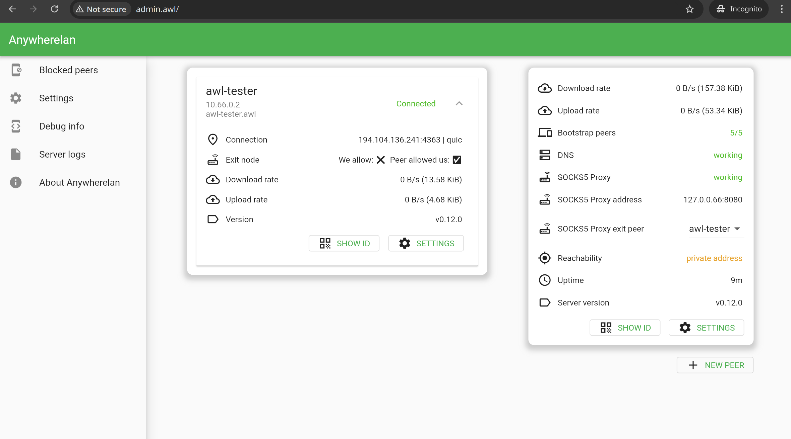
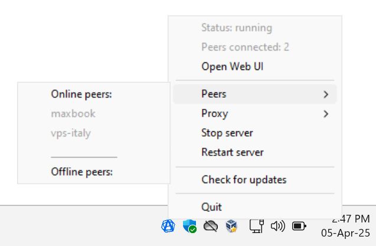
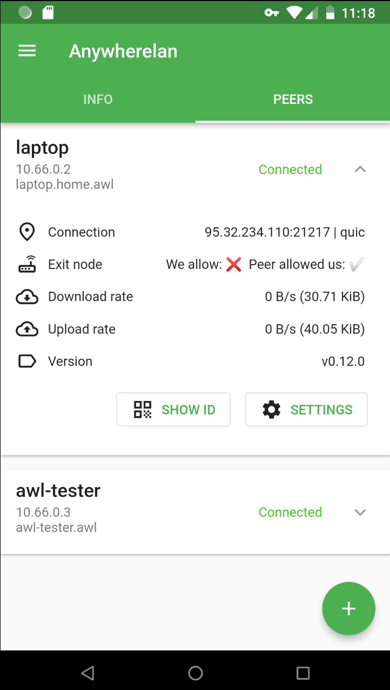

<p align="center">
    <a href="https://github.com/anywherelan/awl/blob/master/LICENSE"></a>
    <a href="https://github.com/anywherelan/awl/releases"></a>
    <a href="https://github.com/anywherelan/awl/actions/workflows/test.yml"></a>
</p>


# About

Anywherelan (awl for brevity) is a mesh VPN project, similar to tinc, direct wireguard or tailscale. Awl makes it easy to connect to any of your devices (at the IP protocol level) wherever they are. It also allows you to route traffic through remote peers like a SOCKS5 proxy.

Some use cases:

- connect to your home/work laptop with RDP/VNC/SSH/etc, which is usually behind NAT. Much easier with awl instead of configuring port forwarding or using heavy centralized VPNs
- get secure access to your selfhosted services like Nextcloud, Home Assistant or Bitwarden without exposing them to the internet
- access websites from another country by using a remote peer as a SOCKS5 proxy
- gaming: local multiplayer like in one LAN
- as an alternative instead of ngrok to share your development server with someone on another device for demonstration
- you can use your old android device remotely with [scrcpy](https://github.com/Genymobile/scrcpy) + awl to run some android-only apps instead of using an emulator on your PC

## Features

- unlike many alternatives, it works fully peer-to-peer, no need to set up or trust any third-party coordination servers. Your traffic goes directly to other devices
- route traffic through remote peers like a SOCKS5 proxy
- easy to use: just download the app, scan QR code of your device, and you're set up
- built-in support for NAT traversal
- if both devices don't have public IP addresses (thus peer-to-peer is unavailable), awl will send your encrypted data through community relays (donates for infrastructure are welcome!)
- TLS encryption
- DNS server built-in. It allows using domains for your devices, like `work-laptop.awl` instead of IP address
- works on Windows, Linux, macOS, Android

## :camera: Screenshots

<div align="center">
  <table cellpadding="0" cellspacing="0" style="margin: auto; border-collapse: collapse;">
    <tr style="border: none;"><td style="border: none;">
      
    </td><td style="border: none;">
      
    </td></tr>
  </table>
</div>

<div align="center">
  <table cellpadding="0" cellspacing="0" style="margin: auto; border-collapse: collapse;">
    <tr style="border: none;"><td style="border: none;">
      
    </td><td style="border: none;">
      
    </td></tr>
  </table>
</div>

## How it works

Awl mainly relies on two libraries: tun/[wintun](https://www.wintun.net/) driver for virtual network interface (networking layer 3, IP) and [libp2p](https://libp2p.io/) as peer-to-peer networking stack.

As a transport awl uses QUIC or TCP with TLS on top. Awl uses [DHT](https://en.wikipedia.org/wiki/Distributed_hash_table) for connecting between peers.

At first, awl connects to community [bootstrap nodes](https://github.com/anywherelan/awl-bootstrap-node), register itself (send peer id (with public key) and public ip addresses) and later asks for addresses of peers you want to connect (all known peers). If peer does not have public addresses, peer could be reached out through bootstrap nodes.

# Installation

For desktop there are two versions: `awl` and `awl-tray`. `awl` is mainly used for servers and other headless purposes and `awl-tray` is for desktop usage: it has nice system tray service (app indicator) to quickly get status of the vpn server, start/stop/restart it or to see which peers are online. Both versions have web-based ui for configuration and monitoring, and terminal interface [cli](#terminal-based-client).

First, download archive from [releases page](https://github.com/anywherelan/awl/releases) for your OS and processor architecture, extract it to any place you like.

## Android

Simply install apk from [releases page](https://github.com/anywherelan/awl/releases) and launch the application.

## Windows desktop (`awl-tray`)

After downloading you need to unpack zip archive and to run program as administrator (right click on binary ➞ run as administrator). This is necessary because only admins can create virtual network interfaces.

It's known problem that some antivirus software may get false detection, in this case you need to manually allow this application.

After starting the program you will see icon in system tray below. Press right click and choose `Open Web UI`. Or you can manually go to the http://admin.awl

## macOS

After downloading you need to unpack zip archive, right-click the `awl-tray` binary and select `Open`. You'll be warned that the app is from unidentified developer (because app isn't signed, it costs money), click "Open" to run it. It will also ask for admin rights. This is necessary because only admins can create virtual network interfaces.

After starting the program you will see icon in the system tray. Press right click and choose `Open Web UI`. Or you can manually go to the http://admin.awl

## Linux

### Desktop (`awl-tray`)

Make sure `zenity` is installed. It's not mandatory, but highly recommended in order to have working notifications and modal dialogs.

```bash
sudo apt install -y zenity
```

After downloading just execute binary as any other app. It will ask root permissions in order to get access to `/dev/tun` and to create virtual network interface. It will automatically create desktop entry, so next time you can run awl from applications list.

After starting the program you will see icon in system tray below. Press right click and choose `Open Web UI`. Or you can manually go to the http://admin.awl

### Server (`awl`)

To automatically install awl use the script below. It will install latest awl version as systemd service `awl.service`, binary and config files will be in `/etc/anywherelan/`. Also, awl will be started on every system reboot.

```bash
curl -sL https://raw.githubusercontent.com/anywherelan/awl/master/install.sh | sudo bash
```

Awl is up and running!

```bash
# print server status
awl cli me status
# set a name for your device
awl cli me rename --name your-name-here
# print your peer id
awl cli me id
# print help
awl cli -h
# print systemd service status
systemctl status awl.service
```

See [cli](#terminal-based-client) for more information on terminal client.

## Connecting peers

To connect two devices with each other, you need to have their `peer_id`s. `peer_id` is a unique identifier of your device. One peer can send "friend invitation" to another. The second peer can accept or block the first one. After accepting the invitation, peers can access each other by their IP on vpn network or by their .awl domain address.

Below you can see example on how you can connect to public peer for testing purposes. This peer will automatically accept any invitations, so you don't need to wait for it.

### Desktop/Android

Go to web interface (http://admin.awl) or run application in case of android. You can find your `peer_id` by clicking `SHOW ID`. To invite peer you need to press `NEW PEER`. Let's add public peer as an example. Enter `peer_id` equal to `12D3KooWJMUjt9b5T1umzgzjLv5yG2ViuuF4qjmN65tsRXZGS1p8` and name it `awl-tester`. After a few seconds you will see a new peer in your list. Now try to go to the http://awl-tester.awl/. You should see a page with network speed test.

Note that awl dns is currently unsupported on Android, see [#17](https://github.com/anywherelan/awl/issues/17). So on Android, you can only access peers by IP addresses.

If someone invites you, a notification will appear, and then you can accept/block this peer in the admin interface.

### Server

```bash
# print your peer_id
awl cli me id
# print server status
awl cli me status
# print all incoming friend requests
awl cli peers requests
# invite peer or accept incoming request
awl cli peers add --pid 12D3KooWJMUjt9b5T1umzgzjLv5yG2ViuuF4qjmN65tsRXZGS1p8 --name awl-tester
# print all known peers
awl cli peers status

# try to access new peer
ping 10.66.0.2
# or by domain name
ping awl-tester.awl
```

## Using peers as SOCK5 proxy

Now that you have connected to your first peer, you can configure it as a SOCKS5 proxy and route your traffic through it. Any peer can be used as a SOCKS5 proxy (even Android devices), but only if they allow it.

To configure it on desktop with web UI go to admin page, select a peer, press Settings, then check `Allow to use my device as exit node` and press save. Now this peer can use your device as SOCKS5 proxy.

How to configure using cli:
```bash
# list all your connected peers and their EXIT NODE status (if they or you allowed to use as a proxy)
awl cli peers list

# allow peer `peer-name` to use this device as a SOCKS5 proxy
awl cli peers allow_exit_node --name="peer-name" --allow=true

# list available exit nodes/SOCKS5 proxies
awl cli me list_proxies

# set current proxy. it will be available on SOCKS5 Proxy address (default 127.0.0.66:8080)
awl cli me set_proxy --name="peer-name"
```

Now you can use selected peer as SOCKS5 proxy, default address is `127.0.0.66:8080`, no auth required. On desktop, you can select peer for proxy in web GUI or in system tray.

When you route your traffic through a peer, there are no restrictions other than your connection between two peers. You can also connect through a relay if you do not have a direct connection. You can access a remote peer's local network through proxy, but you can't access localhost.

## Config file location

Awl looks for config file `config_awl.json` in paths in this order:

- in directory provided by environment variable `AWL_DATA_DIR`, if set. If path does not exist or there is no config file, awl will initialize new config in this path
- in the same directory as executable (if config file exists here)
- in OS-specific config directory. For example, on Linux it's `$HOME/.config/anywherelan/`, on Windows it's `%AppData%/anywherelan/` and on macOS it's `$HOME/Library/Application Support/anywherelan/`. If there is no config here, awl will initialize new config in this path

Tip: you can force using config file in the same directory with executable by creating `config_awl.json` with content `{}` before first launch.

It is not recommended to amend config file while application is still running.

## Terminal based client

Both `awl` and `awl-tray` versions have CLI to communicate with vpn server.

TODO: examples

```
$ ./awl cli -h     
NAME:
   awl cli - p2p mesh vpn

USAGE:
   awl cli [global options] command [command options]

VERSION:
   v0.12.0

DESCRIPTION:
   Anywherelan (awl for brevity) is a mesh VPN project, similar to tinc, direct wireguard or tailscale. Awl makes it easy to connect to any of your devices (at the IP protocol level) wherever they are.
   See more at the project page https://github.com/anywherelan/awl

COMMANDS:
   me         Group of commands to work with your status and settings
   peers      Group of commands to work with peers. Use to check friend requests and work with known peers
   logs, log  Prints application logs (default print 10 logs from the end of logs)
   p2p_info   Prints p2p debug info
   update     Updates awl to the latest version
   help, h    Shows a list of commands or help for one command

GLOBAL OPTIONS:
   --api_addr value  awl api address, example: 127.0.0.1:8639
   --help, -h        show help
   --version, -v     print the version
```

## Upgrading

### Desktop

On desktop (`awl-tray`) you can upgrade application by clicking system tray icon ➞ `Check for updates`. It will ask for confirmation and replace the binary with the new version and restart the app.

### Android

Awl is not yet published in any store, so the only option is to download new version .apk from the [releases page](https://github.com/anywherelan/awl/releases) and install it manually.

### Server

You can easily upgrade and restart `awl` on remote host while being connected to it by `awl` (through ssh for example) and your connection won't be terminated.

```bash
# run under root
cd /etc/anywherelan
# no need to stop awl beforehand
./awl cli update
# restart with systemd in case you installed awl as described in Installation section
systemctl restart awl
# print current status
./awl cli me status
```

As alternative, on Desktop/Server you can download new version from [releases page](https://github.com/anywherelan/awl/releases) and manually replace old files with new ones.

# Roadmap

- performance improvements for vpn tunnel protocol
- exit nodes - let you route all internet traffic through other peers
- add support for awl dns for android ([#17](https://github.com/anywherelan/awl/issues/17))

# Contributing

Contributions to this repository are very welcome.

You can help by creating:
- Bug reports - unexpected behavior, crashes
- Feature proposals - proposal to change/add/delete some features
- Documentation - improves to this README.md are appreciated
- Pull Requests - implementing a new feature yourself or fixing bugs. If the change is big, then it's a good idea to open a new issue first to discuss changes.

# License

The project is licensed under the [MPLv2](LICENSE).
